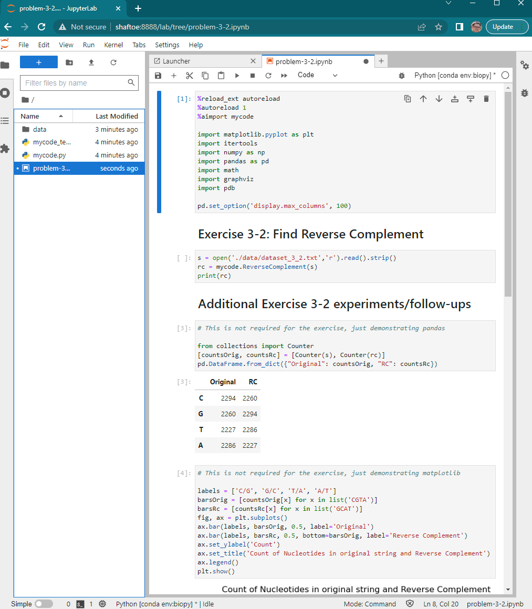
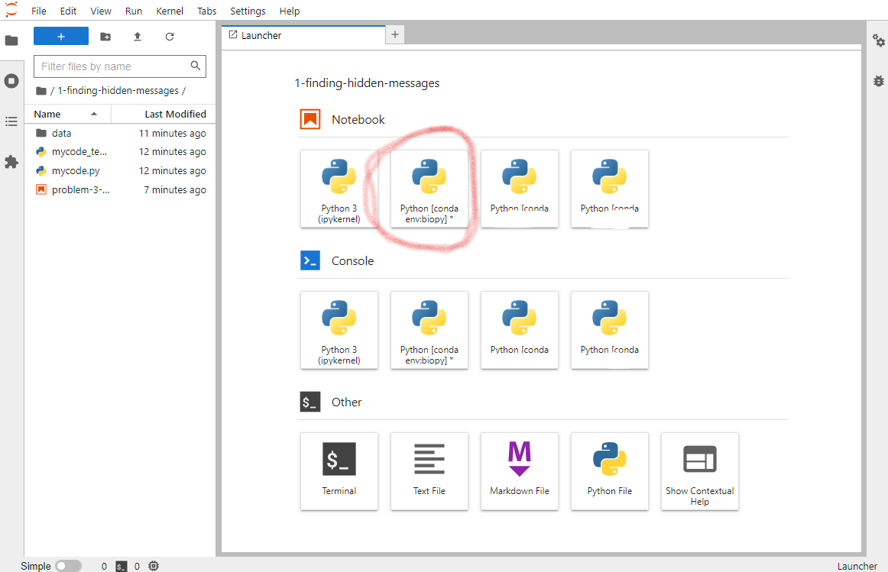

# bioinformatics-algorithms-setup

My setup for completing Stepik exercises for Pevzner/Compeau [Bioinformatics
Algorithms](https://www.bioinformaticsalgorithms.org/)

This is based on Python and Jupyter Notebook.  You can use any programming
language you want but Python is a very popular choice.

More info available on my blog.

## How to use it

1. Prerequisites

- Git
- Conda: I recommend [miniconda](https://conda.io/projects/conda/en/latest/user-guide/install/index.html))

### 1. Clone this locally:

```
git clone git@github.com:andrewjjenkins/bioinformatics-algorithms-setup.git
```

### 2. Setup 

```
conda env create --name biopy -f environment.yaml
```

This creates an environment named `biopy`. 

### 3. Activate

```
conda activate biopy
```

You must repeat this command every time you open a new shell.

### 4. Start jupyter server

```
jupyter-lab --config=./jupyter_lab_config.py
```

This starts the jupyter server but only allows connections from your local
computer.  The console will contain output like this:

```
To access the server, open this file in a browser:
    file:///home/<username>/.local/share/jupyter/runtime/jpserver-1651234-open.html
Or copy and paste one of these URLs:
    http://localhost:8888/lab?token=e9720a0d......
 or http://127.0.0.1:8888/lab?token=e9720a0d......
```

The extra junk at the end of the URL (`e9720a0d...`) is a token that allows you
to connect to Jupyter.  Some security is important because Jupyter can run
arbitrary code on your computer.  The token prevents this.  In addition, the
default configuration only allows loopback connections (from your own computer,
not over the network).

Instead, you could set a permanent password or also allow connections from
other computers in your network.  Edit `jupyter_lab_config.py` (or see the
Jupyter documentation).

### 5. Open Jupyter

Click the link provided, or copy-paste it to your browser (including all the
`?token=e9720a0d...`).  Jupyter may have auto-opened a browser window for you
already.

Navigate into the folder `1-finding-hidden-messages` and double-click on
`problem-3-2.ipynb` and the notebook should open, you should see something like
this:



You can re-run the example by clicking `Kernel -> Restart Kernal and Run All
Cells`.  If this works, your environment is set up well.

## Development

I recommend developing all the algorithms in `mycode.py` and using the jupyter
notebooks just for reading files or rendering output.  The algorithms are often
re-used from problem to problem.

I put unit tests in `mycode_test.py` and run using `python mycode_test.py`.
You can also name a specific suite of tests (`python mycode_test.py
HammingDistance`) or individual test (`python mycode_test.py
HammingDistance.TestSimpleDistance`).  The example input/outputs in Stepik are
good candidates for unit tests.

## Making New Notebooks

When you make a new notebook, make sure you choose to use the right Jupyter
kernel - you want the Python kernel associated with the conda env you set up.
This usually happens by default (since you started jupyter in that env), but if
you get weird import errors, this is a good thing to check.



## Adding packages

If you want to add or update the packages, edit `environment.yml` and then run:

```
conda env update -f environment.yml
```

